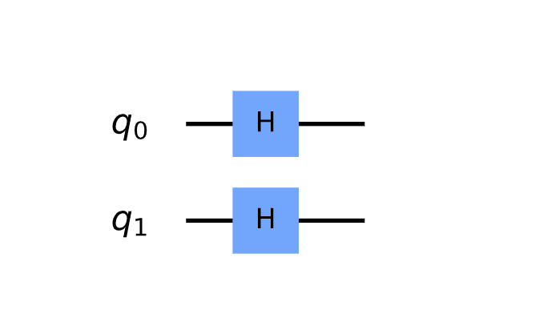

# _A New Belief System_
_Random Matrix Theory Applied to Deep Belief Signaling Networks_

---
## [A Formal Belief System](arch_start/ARCH_0/ARCH_0.md)


## Python and Qiskit Implementation
```python
# Run inference on information shared between random populations of...
belief_prop = bp.random(population, environments, neural_architectures: neural_ode, gan, cnn, rnn; depth: multi, ...)

# Analyze intersection of neural architectures and environments(graph signal processing)
GSP.engine(analysis(union for belief_prop), algo_seq: [forward, backward, forward])
```

---
`GSP.engine` can be further optimized through quantum topological search:

```python
# Initialization
import matplotlib.pyplot as plt
import numpy as np

# Importing Qiskit
from qiskit import IBMQ, Aer, QuantumCircuit, ClassicalRegister, QuantumRegister, execute
from qiskit.providers.ibmq import least_busy
from qiskit.quantum_info import Statevector

# Import basic plot tools
from qiskit.visualization import plot_histogram

# Initialize quantum components
n = 2 # qubits
grover_circuit = QuantumCircuit(n)
grover_circuit = initialize_s(grover_circuit, [0,1])
grover_circuit.draw()

def initialize_s(qc, qubits):
    """Apply a H-gate to 'qubits' in qc"""
    for q in qubits:
        qc.h(q)
    return qc
```


.
.
.
.
. 
And so on

_See references for quantum computing, graph signal processing, and belief propagation:_
[📖](references.md)